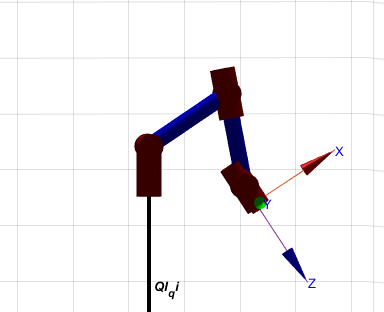
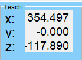
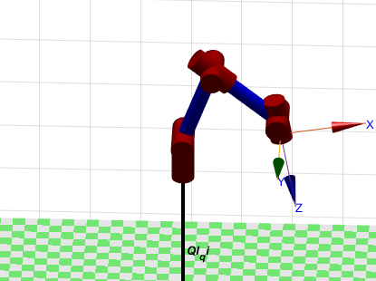
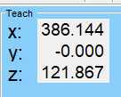
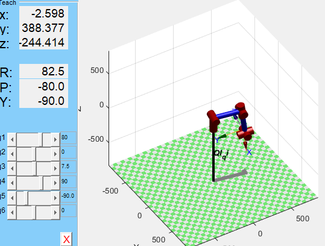

测试各个功能代码
static void test1()
{

    // planning_data.[0] = 251.345;
    // planning_data.[1] =  145.114;
    // planning_data.[2] = -35.466;

    // planning_data.[3] = -169.7;
    // planning_data.[4] =  17.2;
    // planning_data.[5] = -31.6;
    // InverseK(planning_data., planning_data.arm_angle,0);
        if(state == 0)
        {
            arm_cmd_send.yaw_4310_angle    = CubicPlanning(0, 30,  100, planning_data.time_clock,&task.finish_flag)*PI/180;
            arm_cmd_send.pitchb_8009_angle = CubicPlanning(0,60,  100, planning_data.time_clock,&task.finish_flag)*PI/180;
            arm_cmd_send.pitchf_8009_angle = CubicPlanning(-40, -45,  100, planning_data.time_clock,&task.finish_flag)*PI/180;
            arm_cmd_send.roll_6020_angle   = CubicPlanning(0,0,  100, planning_data.time_clock,&task.finish_flag)*PI/180;
            arm_cmd_send.pitch_2006_angle  = CubicPlanning(0, -10,  100, planning_data.time_clock,&task.finish_flag)*PI/180;
            arm_cmd_send.roll_2006_angle   = CubicPlanning(0, 0,  100, planning_data.time_clock,&task.finish_flag)*PI/180;
             planning_data.time_clock+=1;
        }
        if(task.finish_flag==1&&state==0)
        {
             planning_data.time_clock = 0;
            task.finish_flag = 0;
            state = 1;
        }
        if(state == 1)
        {
            arm_cmd_send.yaw_4310_angle =       CubicPlanning(30, 0,  100, planning_data.time_clock,&task.finish_flag)*PI/180;
            arm_cmd_send.pitchb_8009_angle =    CubicPlanning(60,0,  100, planning_data.time_clock,&task.finish_flag)*PI/180;
            arm_cmd_send.pitchf_8009_angle =    CubicPlanning(-45, -40,  100, planning_data.time_clock,&task.finish_flag)*PI/180;
            arm_cmd_send.roll_6020_angle =  CubicPlanning(0,0,  100, planning_data.time_clock,&task.finish_flag)*PI/180;
            arm_cmd_send.pitch_2006_angle = CubicPlanning(-10, 0,  100, planning_data.time_clock,&task.finish_flag)*PI/180;
            arm_cmd_send.roll_2006_angle  = CubicPlanning(0, 0,  100, planning_data.time_clock,&task.finish_flag)*PI/180; 
             planning_data.time_clock+=1;
        }
        if(task.finish_flag==1&&state==1)
        {
             planning_data.time_clock = 0;
            task.finish_flag = 0;
            state = 0;
        }
}

static void test2()
{

        if(state == 0)
        {
            // arm_cmd_send.yaw_4310_angle    = CubicPlanning(0, 30,  100, planning_data.time_clock,&task.finish_flag)*PI/180;
            // arm_cmd_send.pitchb_8009_angle = AngleChange(0,60,  100, planning_data.time_clock,&task.finish_flag)*PI/180;
            // arm_cmd_send.pitchf_8009_angle = CubicPlanning(-40, -45,  100, planning_data.time_clock,&task.finish_flag)*PI/180;
            // arm_cmd_send.roll_6020_angle   = CubicPlanning(0,0,  100, planning_data.time_clock,&task.finish_flag)*PI/180;
            // arm_cmd_send.pitch_2006_angle  = CubicPlanning(0, -10,  100, planning_data.time_clock,&task.finish_flag)*PI/180;
            // arm_cmd_send.roll_2006_angle   = CubicPlanning(0, 0,  100, planning_data.time_clock,&task.finish_flag)*PI/180;
            planning_data.arm_angle[1]=CubicPlanning(0,60,1000, planning_data.time_clock,&task.finish_flag)*PI/180;
             planning_data.time_clock+=1;
        }
        if(task.finish_flag==1&&state==0)
        {
             planning_data.time_clock = 0;
            task.finish_flag = 0;
            state = 1;
        }
        if(state == 1)
        {
            planning_data.arm_angle[1]=CubicPlanning(60,0,1000, planning_data.time_clock,&task.finish_flag)*PI/180;

            // arm_cmd_send.yaw_4310_angle =       CubicPlanning(30, 0,  100, planning_data.time_clock,&task.finish_flag)*PI/180;
            // arm_cmd_send.pitchb_8009_angle =    AngleChange(60,0,  100, planning_data.time_clock,&task.finish_flag)*PI/180;
            // arm_cmd_send.pitchf_8009_angle =    CubicPlanning(-45, -40,  100, planning_data.time_clock,&task.finish_flag)*PI/180;
            // arm_cmd_send.roll_6020_angle =  CubicPlanning(0,0,  100, planning_data.time_clock,&task.finish_flag)*PI/180;
            // arm_cmd_send.pitch_2006_angle = CubicPlanning(-10, 0,  100, planning_data.time_clock,&task.finish_flag)*PI/180;
            // arm_cmd_send.roll_2006_angle  = CubicPlanning(0, 0,  100, planning_data.time_clock,&task.finish_flag)*PI/180; 
             planning_data.time_clock+=1;
        }
        if(task.finish_flag==1&&state==1)
        {
             planning_data.time_clock = 0;
            task.finish_flag = 0;
            state = 0;
        }
}

static void test3()
{
    planning_data.arm_angle[0]=0.52+planning_data.arm_angle[1]+angle_diff[1];
    planning_data.last_angle[0]=arm_cmd_send.pitchb_8009_angle;
    angle_diff[0]=planning_data.arm_angle[0]-planning_data.last_angle[0];
    arm_cmd_send.pitchb_8009_angle= AngleChange2(planning_data.last_angle[0],angle_diff[0],0.1);
}

static void test4()
{
    planning_data.arm_angle[0]=0.52+angle_diff[1];
    planning_data.last_angle[0]=arm_cmd_send.pitchb_8009_angle;
    angle_diff[0]=planning_data.arm_angle[0]-planning_data.last_angle[0];
    arm_cmd_send.pitchb_8009_angle= AngleChange2(planning_data.last_angle[0],angle_diff[0],0.1);
}

## 取矿规划
1. 步骤1：吸矿

（逆运动学解算用到的参数）

2. 步骤2：拿起

3. 步骤3：放到自己的吸盘上

4. 步骤4：取第二个矿
5. 拿去回家