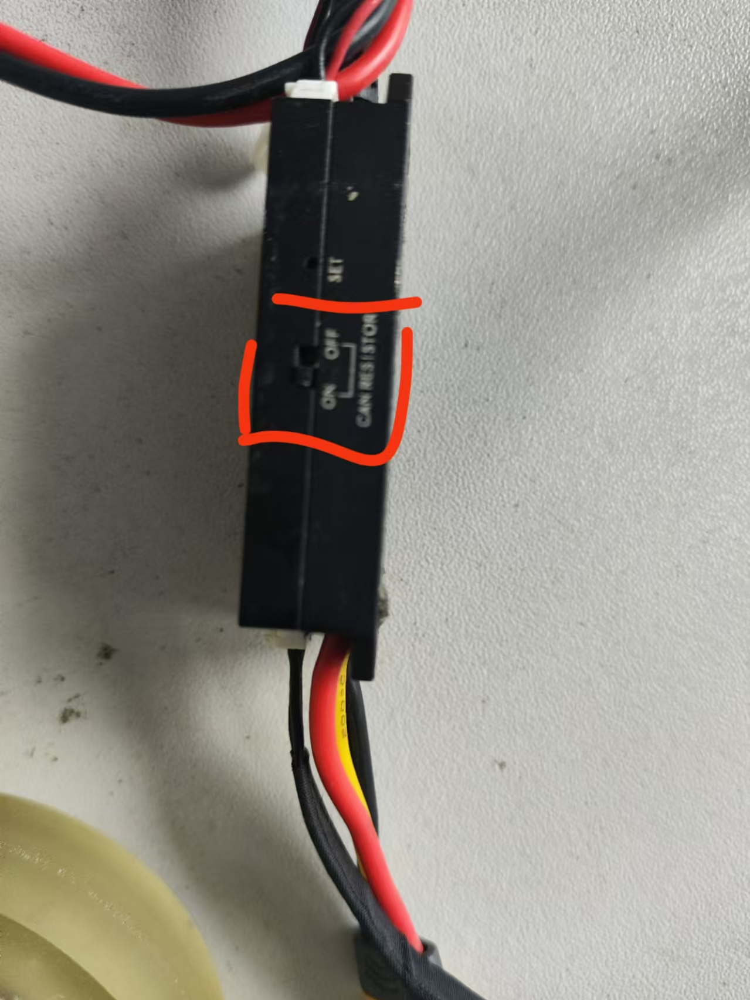
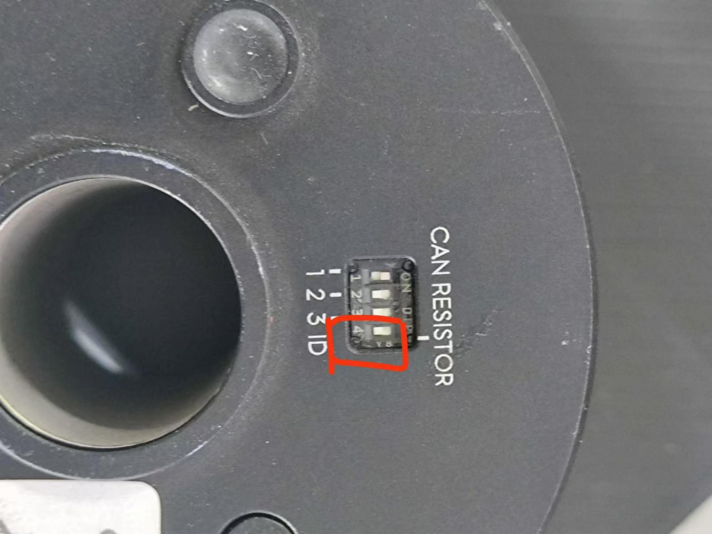

# bsp_can

## 注意事项：
请注意使用CAN设备的时候务必保证总线只接入了2个终端电阻(CAN_REGISTER)！开发板一般都有一个，6020电机、c620/c610电调、LK电机也都有终端电阻，注意把多于2个的全部断开（通过拨码）

之前我们的英雄就是因为这个问题，一直无法接那么多个负载，所以说如果遇到无法驱动多个电机的时候，请务必注意使用CAN设备的时候务必保证总线只接入了2个终端电阻！

 
 
 

## 使用说明

若你希望新增一个基于CAN的module，首先在该模块下应该有一个包含`can_instance`指针的module结构体。

## 代码结构

.h文件内包括了外部接口和类型定义,以及模块对应的宏。c文件内为私有函数和外部接口的定义。

## 类型定义

```c

#define MX_REGISTER_DEVICE_CNT 6    //最大的CAN设备注册数量，当每个设备的发送频率都较高时，设备过多会产生总线拥塞从而出现丢包和数据错误的情况。(合适数量为4-6)
#define DEVICE_CAN_CNT 3            // 根据板子设定,C/A板有CAN1、CAN2，喵板有CAN1、CAN2、CAN3


typedef struct _
{
    CAN_HandleTypeDef *can_handle; // can句柄
    CAN_TxHeaderTypeDef txconf;    // CAN报文发送配置
    uint32_t tx_id;                // 发送id
    uint8_t tx_buff[8];            // 发送缓存,发送消息长度可以通过CANSetDLC()设定,最大为8
    uint8_t rx_buff[8];            // 接收缓存,最大消息长度为8
    uint32_t rx_id;                // 接收id
    uint8_t rx_len;                // 接收长度,可能为0-8
    // 接收的回调函数,用于解析接收到的数据
    void (*can_module_callback)(struct _ *); // callback needs an instance to tell among registered ones
    void *id;                                // 使用can外设的模块指针(即id指向的模块拥有此can实例,是父子关系)
} CANInstance;

typedef struct 
{
    CAN_HandleTypeDef* can_handle;
    uint32_t tx_id;
    uint32_t rx_id;
    void (*can_module_callback)(can_instance*);
    void* id;
} can_instance_config;

typedef void (*can_callback)(can_instance*);
```

- `MX_REGISTER_DEVICE_CNT`是最大的CAN设备注册数量，当每个设备的发送频率都较高时，设备过多会产生总线拥塞从而出现丢包和数据错误的情况。
- `DEVICE_CAN_CNT`是MCU拥有的CAN硬件数量。

- `can_instance`是一个CAN实例。注意，CAN作为一个总线设备，一条总线上可以挂载多个设备，因此多个设备可以共享同一个CAN硬件。其成员变量包括发送id，发送邮箱（不需要管，只是一个32位变量，CAN收发器会自动设置其值），发送buff以及接收buff，还有接收id和接收协议解析回调函数。**由于目前使用的设备每个数据帧的长度都是8，因此收发buff长度暂时固定为8**。定义该结构体的时候使用了一个技巧，使得在结构体内部可以用结构体自身的指针作为成员，即`can_module_callback`的定义。

- `can_instance_config`是用于初始化CAN实例的结构，在调用CAN实例的初始化函数时传入（下面介绍函数时详细介绍）。

- `can_module_callback()`是模块提供给CAN接收中断回调函数使用的协议解析函数指针。对于每个需要CAN的模块，需要定义一个这样的函数用于解包数据。
- 每个使用CAN外设的module，都需要在其内部定义一个`can_instance*`。


## 外部接口

```c
void CANRegister(can_instance* instance, can_instance_config config);
void CANSetDLC(CANInstance *_instance, uint8_t length); // 设置发送帧的数据长度
uint8_t CANTransmit(can_instance* _instance, uint8_t timeout);
```

`CANRegister`是用于初始化CAN实例的接口，module层的模块对象（也应当为一个结构体）内要包含一个`usart_instance`。调用时传入实例指针，以及用于初始化的config。`CANRegister`应当在module的初始化函数内被调用，推荐config采用以下的方式定义，更加直观明了：

```c
can_instance_config config={.can_handle=&hfdcan1,
							.tx_id=0x005,
							.rx_id=0x200,
							can_module_callback=MotorCallback}
```

`CANTransmit()`是通过模块通过其拥有的CAN实例发送数据的接口，调用时传入对应的instance。在发送之前，应当给instance内的`send_buff`赋值。

## 私有函数和变量

在.c文件内设为static的函数和变量

```c
static can_instance *instance[MX_REGISTER_DEVICE_CNT]={NULL};
```

这是bsp层管理所有CAN实例的入口。

```c
static void CANServiceInit()
static void CANAddFilter(can_instance *_instance)
static void CANFIFOxCallback(CAN_HandleTypeDef *_hfdcan, uint32_t fifox)
void HAL_CAN_RxFifo0MsgPendingCallback(CAN_HandleTypeDef *hfdcan)
void HAL_CAN_RxFifo1MsgPendingCallback(CAN_HandleTypeDef *hfdcan)
```

- `CANServiceInit()`会被`CANRegister()`调用，对CAN外设进行硬件初始化并开启接收中断和消息提醒。

- `CANAddFilter()`在每次使用`CANRegister()`的时候被调用，用于给当前注册的实例添加过滤器规则并设定处理对应`rx_id`的接收FIFO。过滤器的作用是减小CAN收发器的压力，只接收符合过滤器规则的报文（否则不会产生接收中断）。

- `HAL_CAN_RxFifo0MsgPendingCallback()`和`HAL_CAN_RxFifo1MsgPendingCallback()`都是对HAL的CAN回调函数的重定义（原本的callback是`__week`修饰的弱定义），当发生FIFO0或FIFO1有新消息到达的时候，对应的callback会被调用。`CANFIFOxCallback()`随后被前两者调用，并根据接收id和硬件中断来源（哪一个CAN硬件，CAN1还是CAN2）调用对应的instance的回调函数进行协议解析。

- 当有一个模块注册了多个can实例时，通过`CANInstance.id`,使用强制类型转换将其转换成对应模块的实例指针，就可以对不同的模块实例进行回调处理了。

## 注意事项

由于CAN总线自带发送检测，如果总线上没有挂载目标设备（接收id和发送报文相同的设备），那么CAN邮箱会被占满而无法发送。在`CANTransmit()`中会对CAN邮箱是否已满进行`while(1)`检查。当超出`timeout`之后函数会返回零，说明发送失败。

由于卡在`while(1)`处不断检查邮箱是否空闲，调用`CANTransmit()`的任务可能无法按时挂起，导致任务定时不精确。建议在没有连接CAN进行调试时，按需注释掉有关CAN发送的代码部分，或设定一个较小的`timeout`值，防止对其他需要精确定时的任务产生影响。